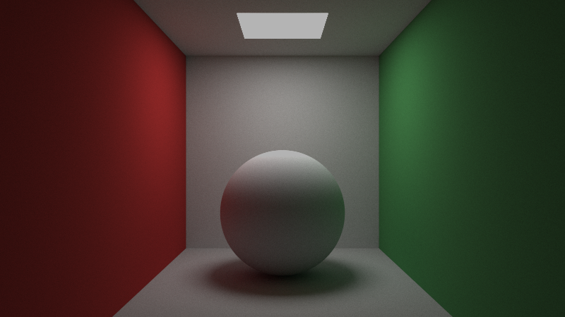
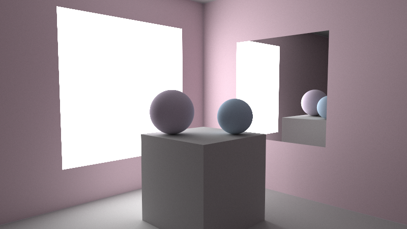

# Real-time Ray Tracer
A real-time path tracing engine developed entirely in C++ using the WinAPI for window management and user input.

## Key Features
- Implemented adaptive resolution rendering by starting at low quality and progressively doubling the sample quality when the camera is stationary to combine real-time interactivity with photorealistic renders.
- Simulated realistic lighting with diffuse surfaces, reflective materials, and configurable light sources, using physically accurate path tracing algorithms.
- Enabled dynamic scene interaction with keyboard and mouse controls for camera movement and viewpoint adjustments.
- Optimized rendering performance by implementing multithreading, resulting in a 10x speedup in render times.

## Sample Renders

